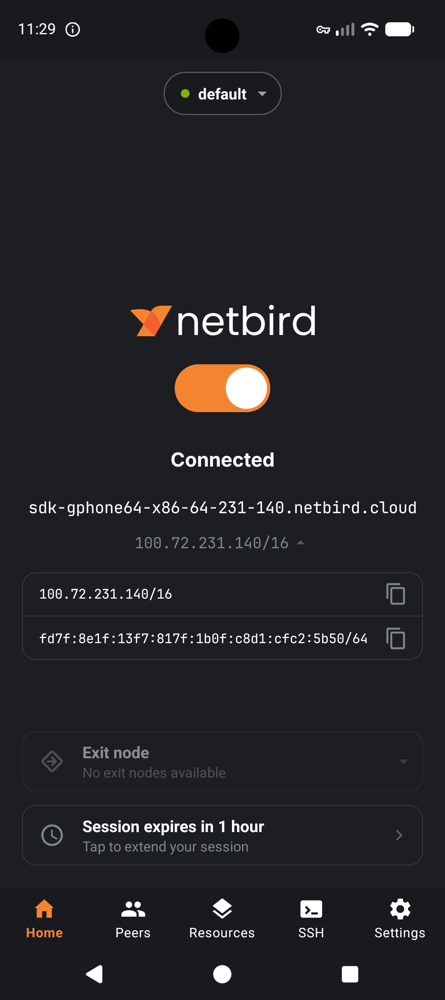
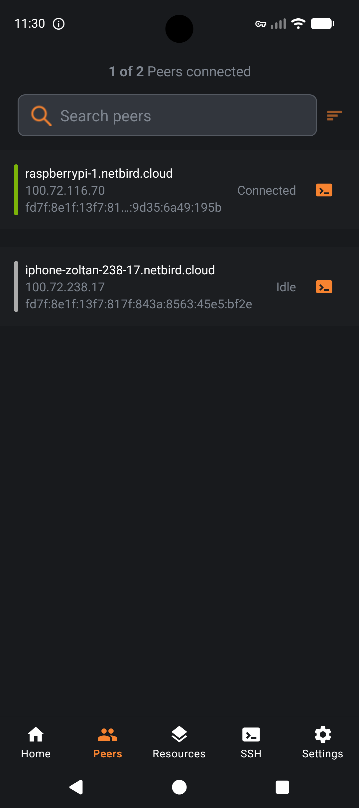
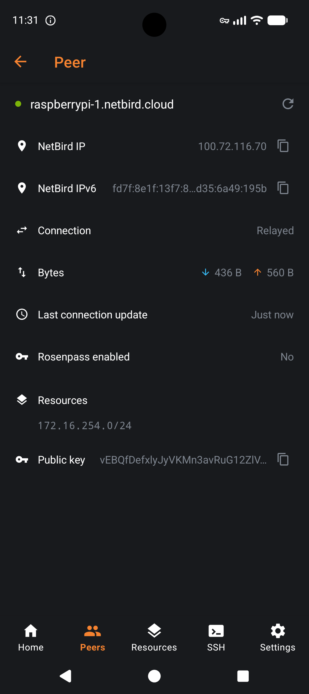

<br/>
<div align="center">
<p align="center">
  
</p>
  <p>
     <a href="https://github.com/netbirdio/netbird/blob/main/LICENSE">
       
     </a>
    <a href="https://docs.netbird.io/slack-url">
        
     </a>    
  </p>
</div>


<p align="center">
<strong>
  Start using NetBird at <a href="https://netbird.io/pricing">netbird.io</a>
  <br/>
  See <a href="https://netbird.io/docs/">Documentation</a>
  <br/>
   Join our <a href="https://docs.netbird.io/slack-url">Slack channel</a>
  <br/>

</strong>
</p>

<br>

# NetBird Android client

The NetBird Android client allows connections from mobile devices running Android to private resources in the NetBird network.

## Screenshots

<p align="center">
  
  
  
</p>

## Install
You can download and install the app from the Google Play Store:

[](https://play.google.com/store/apps/details?id=io.netbird.client)

## Reporting bugs and requesting features

NetBird uses a discussion-first workflow across all its repositories. Bug reports and
feature requests for the Android client start in
[netbird Discussions](https://github.com/netbirdio/netbird/discussions), not as issues here.

| What you want to do | Where to go |
| --- | --- |
| Report a bug, regression, or unexpected behavior | [Issue Triage](https://github.com/netbirdio/netbird/discussions/new?category=issue-triage) |
| Request a feature or share an idea | [Ideas & Feature Requests](https://github.com/netbirdio/netbird/discussions/new?category=ideas-feature-requests) |
| Ask about setup, configuration, or self-hosting | [Q&A / Support](https://github.com/netbirdio/netbird/discussions/new?category=q-a-support) |
| Report a security vulnerability | [Security policy](https://github.com/netbirdio/netbird/security/policy), never a public thread |

Our team triages each discussion. Validated reports become issues in this repository,
linked back to the discussion. See
[How to use Discussions, Issues, and Pull Requests](https://github.com/netbirdio/netbird/discussions/6075)
for the full workflow.

## Building from source
### Requirements
We need the following software:
* Java 1.11. Usually comes with Android Studio
* android studio initialized with jdk and emulator (not covered here, is a req from android-client project)
* gradle (https://gradle.org/install/)

### Prepare development environment
1. Close all repositories:
> assuming you use a path like ~/projects locally
```shell
mkdir ~/projects
cd projects
# clone netbird repo
git clone --recurse-submodules git@github.com:netbirdio/android-client.git
```
2. Checkout the repositories to the branches you want to test. If you want the latest, check the status information on your IDE or on https://github.com and verify the branch list and commit history.
3. Export JDK and Android home vars, on macOS they are: (please contribute with Linux equivalent)
```shell
# replace <USERNAME> with your name
export ANDROID_HOME=/Users/<USERNAME>/Library/Android/sdk
export JAVA_HOME=/Applications/Android Studio.app/Contents/jbr/Contents/Home
```
4. Install NDK and CMake
```shell
cd ~/projects/android-client
$ANDROID_HOME/cmdline-tools/latest/bin/sdkmanager --install "ndk;23.1.7779620"
```
### Generate debug bundle
Follow the steps to run locally until the step 5 then run the following steps:
1. Build Go agent library
```shell
cd ~/projects/android-client
./build-android-lib.sh
```
2. Run gradlew
```shell
cd ~/projects/android-client/android
./gradlew bundleDebug  -PversionCode=123 -PversionName=1.2.3
```
